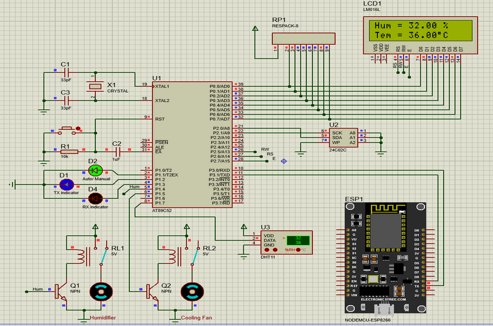

# Cold Storage Control System
IoT Project

## Introduction
This is an IOT project, help to control temperature & humidity in a Cold Storage via the internet. Depend on the kind of storage (i.e. fruits, vaccine, food... ), the device can auto maintain temperature & humidity base on the pre-configuration.

## Featured
- Control over the internet (Using Thingsboard)
- Auto mode: Setup the temperature & humidity threshold base on the kind of storage, maintain proper temperature/humidity by auto control turn on/off Cooling Fan & Humidifier Machine
- Manual mode: control Cooling Fan & Humidifier Machine manually

## How it work?


Fully control over internet

Sensor's metrics will be collected by 8051 and saved on EEPROM, 8051 also control the Cooling Fan & Humidifier Machine on or off.

ESP8266 will help to connect to internet (Thingsboard), transmit data between 8051 & Thingsboard

8051 also help to saved the configurations from Thingsboard to EEPROM

## Thingsboard's dashboard controller

The metrics of Temperature & humidity will keeping sync-up from DHT11 sensor to Thingsboard.

The dashboard presents real time Temperature/Humidity metrics.

The dashboard support to switch between working modes (auto-manual).

- Mode Auto: User can config the proper thresholds and the 8051 will auto maintain temperature/humdity by control Cooling Fan/Humidifier Machine.

- Mode Manual: Fully control Cooling Fan/Humidifier Machine on or off

Comunicate with ESP8266 using protocol Message Queueing Telemetry Transport (MQTT) - Remote Procedure Calls (RPC) API. Service provider: Thingsboard's message broker

> There is a schedule from Thingsboard that send an RCP request to update telemetry, this will keep the metrics up-to-date every 20 seconds.

Download dashboard json [here](./esp8266/cold_storage_management.json).


## Circuit


## Hardwares

- 8051 - MCU
- ESP8266 - Microcontroller
- DHT11 - Sensor
- LCD 16x2
- EEPROM 24C02
- 5 LEDs

### Hardware Protocols used
- UART: transmit data between 8051 & ESP8266
- I/O: LCD, LED indicators, control Cooling Fan & Humidifier Machine, DHT11 sensor
- I2C: integrate with EEPROM to read & write data

### Configurations
#### ESP8266
```ino
// wifi access
const char* WIFI_SSID = "[YOUR_SSID]";
const char* WIFI_PASSWORD = "[YOUR_WIFI_PASSOWRD]";

// Thingsboards configuration
const char* THINGSBOARD_TOKEN = "[YOUR_TOKEN]";
constexpr char THINGSBOARD_SERVER[] = "thingsboard.cloud";

// UART
SoftwareSerial my_uart(13, 15);  // RX, TX
```

#### 8051
```cpp
// Control Cooling Fan & Humdifier Machine
sbit CTRL_T = P1 ^ 6; // Cooling Fan
sbit CTRL_H = P1 ^ 5; // Humidifier Machine

// LED Indicators
sbit LED1 = P1 ^ 4;   // UART RX indicator
sbit LED2 = P1 ^ 3;   // UART TX indicator
sbit LED_WM = P1 ^ 2; // Working Mode (auto/manual) indicator

// I2C
sbit SDA=P2^0;
sbit SCL=P2^1;

// DHT11 sensor
sbit DHT11 = P1^7;
```

#### UART Command Codes when communicate between 8051 & ESP8266


#### EEPROM Address - Where the data was storaged


## Video Demo
[](https://www.youtube.com/watch?v=pO4Ov4dsSpQ)
